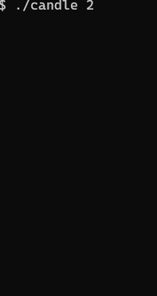

# What is this?
This is Joke command to display candle fire on your terminal.<br>
Terminal running this command must supporting 256 colors.<br>
# How to use
## usage
```
Usage: candle [DURATIONTIME]

Positional arguments:
  DURATIONTIME           [Optional]duration time

Options:
  --help, -h             display this help and exit
```

ex.) display candle for three seconds<br>
```
candle 3
```


## key bindings
[esc / CTRL+C] - exit<br>

# Win/Mac/Linux binary
https://github.com/y-hatano-github/candle/releases

# How to get and run the code.
## build version
go1.18
## 1st step
Get the code.
```
go get -d github.com/y-hatano-github/candle
```
## 2nd step
Change directory to the source code directory.
```
cd $GOPATH/src/github.com/y-hatano-github/candle
```
## 3rd step
Run the code.
```
go run main.go
```
