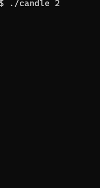

# 🕯️ Candle
This is a joke command that displays a candle-like fire effect in your terminal.  
It renders a retro-style flame animation that serves absolutely no purpose—other than looking cool.  
Requires a terminal with 256-color support.  

## ⚙️ Features
- 🔥 Retro-style flame rendering.
- ⏳ Configurable display duration.
- 🎨 256-color terminal required.
- 🖥️ Cross-platform binaries (Windows, macOS, Linux)

## 💾 Download
👉 Get the latest release here:
https://github.com/yoshihicode/candle/releases/latest

## 📦 Installation
### 🐧 Linux
```bash
wget https://github.com/yoshihicode/candle/releases/latest/download/candle_linux_amd64.tar.gz
tar -xzvf candle_linux_amd64.tar.gz
mv candle /usr/local/bin/

#Run
candle
```

### 🍎🍺 macOS / Homebrew
```bash
brew install yoshihicode/tap/candle
candle

# Run
candle
```

### 🪟 Windows
```powershell
Invoke-WebRequest -OutFile candle_windows_amd64.tar.gz https://github.com/yoshihicode/candle/releases/latest/download/candle_windows_amd64.tar.gz
tar -xzvf  candle_windows_amd64.tar.gz

# Run
.\candle.exe
```

## 📘 Usage
```
Usage: candle [DURATIONTIME]

Positional arguments:
  DURATIONTIME           [Optional]duration time

Options:
  --help, -h             display this help and exit
```

Example: display the candle flame for three seconds  
```
candle 3
```
## ⌨️ Key bindings
[esc / CTRL+C] - exit  

## 🛠️ Build from source
```bash
git clone https://github.com/yoshihicode/candle.git
cd candle
go build -o candle
./candle
```
